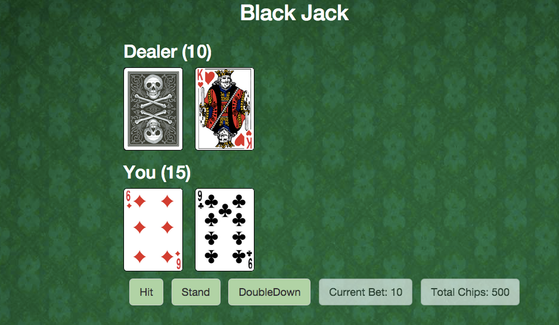

For the past two days at [Hack Reactor](http://hackreactor.com/), my partner
and I built a simple blackjack app using CoffeeScript and Backbone.



CoffeeScript is pretty confusing at first, so I'll be listing out some useful
syntaxes when using CoffeeScript.

```js
// Keyword "this"
// JavaScript
this.set('someAttribute', 10);
this.get('someAttribute');
// CoffeeScript
@set 'someAttribute', 10
@get 'someAttribute'

// Function and if statements
// JavaScript
var func = function(num) {
  if (num > 0) {
    alert('Positive Number!');
  } else {
    alert('Negative Number!');
  }
}
// CoffeeScript
func = (num) ->
  if num > 0
    alert 'Positive Number!'
  else
    alert 'Negative Number!'

// Variable substitution
// JavaScript
var imgString = "img/some-image.png";
this.css("background-image", "url(" + imgString + ")");
// CoffeeScript
imgString = "img/some-image.png"
@css 'background-image', "url(#{imgString})"

// Backticks to use standard Javascript code in CoffeeScript
`
var usingJavaScript = true;
if (usingJavaScript) {
  ("Using Javascript code in CoffeeScript!")
}
`
```
