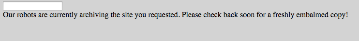

Today at [Hack Reactor](http://hackreactor.com/), my partner and I built a simple
version of [archive.org](https://archive.org/) using Node.js and Cron. Here is
what it looks like.


Enter an URL that you want to archive.



[Cron](http://en.wikipedia.org/wiki/Cron), a time-based job scheduler, will call
one of our scripts that fetches HTML of that URL. This HMTL is stored
in our database. Now if we type www.chess.com again...


Now we have the archived version of www.chess.com!

Here are some resources that I thought were useful in building this application:

1. [Kevin Chisholm's Tutorials](http://blog.kevinchisholm.com/javascript/node-js/making-a-simple-http-server-with-node-js-part-iv/) were very helpful in learning about how to serve up the html file on the Node.js server.
2. [This Question on Stack Overflow](http://stackoverflow.com/questions/5849402/how-can-you-execute-a-node-js-script-via-a-cron-job) helped
my partner and I to set up Cron. Cron uses absolute path for files and scripts, so make sure that you specify
absolute paths to node (use bash node -v to find it out) and scripts that you want to run.
3. As always, [Node.js API Documentation](http://nodejs.org/api/) is your friend.
4. Pattern below is useful to include in your server's request-handler.

```js
var data = '';
// Grab data coming from the client via 'POST' request
request.on('data', function(chunk)) {
  data += chunk;
}
// Due to asynchronicity of the code above, we wait until the code
// ends before working with the data
request.on('end', function() {
  // Do something with data
});
```
